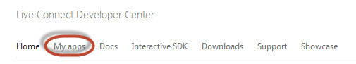
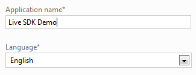
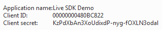
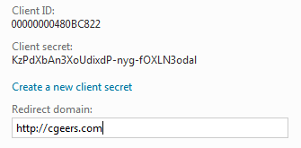
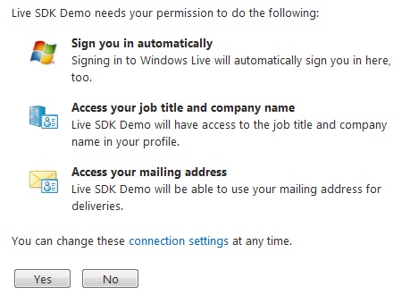
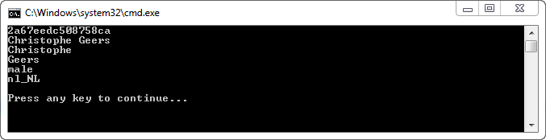

# Getting Started with the Live SDK: Authorization

## Introduction

In a move to compete with DropBox, Google Drive...etc. Microsoft revamped SkyDrive this week incorporating most of [Mesh](http://windows.microsoft.com/en-US/windows-live/mesh-devices-sync-upgrade-ui)'s features. If you signed up for SkyDrive before April 22nd, and have uploaded at least one file, be sure to apply for the [free upgrade](https://skydrive.live.com/ManageStorage) to 25 GB.

I wrote a couple of articles on the use of the [DropBox REST API](https://github.com/geersch/DropboxRESTApi). Microsoft's revamp made me curious to see if I could do the same with the SkyDrive API.

## Register Your Application

The SkyDrive API is part of the Live SDK, which allows you to use SkyDrive, Hotmail, Messenger and Live Id. Before you can get started you need to register your application at the [Live Connect Developer Center](http://msdn.microsoft.com/en-us/live/ff519582).

Just sign in with your Windows Live Id and then click "My Apps" in the upper left corner.



You have 100 available application slots. Just click "Create Application". You only need to fill in two fields, the application's name and language.



Afterwards you'll receive a client ID and secret.



Yes, I changed the secret by the time you are reading this.

After you've created the application you need to change one little thing. Go back to the applications overview page and select the newly created application. Click "Edit Settings" and then select the "API Settings" option. Here you need to enter a valid redirect domain. This needs to be set correctly if you want the authorization process to succeed.



**Remark**: You can only use the same redirect domain for one application!

## REST Reference

You can use the Representation State Transfer (REST) API to work with the Live API. Using the REST API you can programmatically access the user's info, contacts, friends, addresses...etc.

You can find the entire REST reference here:

[http://msdn.microsoft.com/en-us/library/live/hh243648.aspx](http://msdn.microsoft.com/en-us/library/live/hh243648.aspx)

Alternatively you can also download the [Windows Live SDK](http://www.microsoft.com/en-us/download/details.aspx?id=8615). The SDK simplifies common task such as signing in, access user data..etc, but I prefer to use the REST API directly.

## OAuth

Live Connect implements the [OAuth](http://oauth.net/) 2.0 protocol to authenticate users. I already covered OAuth in the following articles:

- [Dropbox REST API Part 1: Authentication](https://github.com/geersch/DropboxRESTApi/tree/master/src/part-1/README.md)
- [Dropbox REST API Part 6: OAuth Callback](https://github.com/geersch/DropboxRESTApi/tree/master/src/part-2/README.md)
- [Bitly API: Authentication](https://github.com/geersch/BitlyAPI)

The implementation is similar for the Live Connect API. Let's quickly cover the authorization flow.

First you need to compose the authorization URL to which you'll redirect the users.

```csharp
var uri = "https://login.live.com/oauth20_authorize.srf";

var authorizeUri = new StringBuilder(uri);

authorizeUri.AppendFormat("?client_id={0}&", "Your Client ID");
authorizeUri.AppendFormat("scope={0}&", "wl.signin");
authorizeUri.AppendFormat("response_type={0}&", "token");
authorizeUri.AppendFormat("redirect_uri={0}", UrlEncode("http://redirect_url.com"));
```

Fill in your client ID and make sure that the redirect URL exactly matches the one you entered when you registered your application.

Using the scope query parameter you can specify the permissions which your application requires. If you want to sign in the user you specify **wl.signin**. If you also want to access the user's work profile and postal addresses you need to also pass **wl.work_profile** and **wl.postal_addresses**. You can find a list of all the available scopes here:

[http://msdn.microsoft.com/en-us/library/live/hh243646](http://msdn.microsoft.com/en-us/library/live/hh243646)

Each scope value needs to be separated by a space (%20).

The value of the response_type query parameter is set to token which requests an authorization token.

**Remark**: The UrlEncode(...) method encodes the redirect URI. Check out the source code of this article to see how the method works. I already explained it in [Part 5](https://github.com/geersch/DropboxRESTApi/tree/master/src/part-5/README.md) of the Dropbox series.

Once you've composed the authorization URI you can redirect the user to it.

```csharp
var startInfo = new ProcessStartInfo();
startInfo.FileName = authorizeUri.ToString();
Process.Start(startInfo);
```

The user will be informed to which parts of his account your application wants access.



After the user authorizes your application he'll be redirected to the URI you specified in the redirect_uri parameter. The redirect URI will be appended with 5 parameters, namely:

- **access_token**: The access token
- **authentication_token**
- **token_type**
- **expires_in**: The number of seconds the access token is valid
- **scope**: The scopes to which the user granted you access

Microsoft uses redictiously long token, over 700 characters! Seriously, why? I believe an Dropbox's access token is about 12 characters long (may vary).


## User Object

Now that we have access to the user's account let's retrieve some profile information. The data is exchanged in JavaScript Object Notation (JSON) format.

For example:

```json
{
  "id": "2a67eedc508758ca",
  "name": "Christophe Geers",
  "first_name": "Christophe",
  "last_name": "Geers",
  "gender": null,
  "locale": "nl_NL"
}
```

So add a reference to the [JSON.NET library](http://james.newtonking.com/) via NuGet. Now let's create a simple [User object](http://msdn.microsoft.com/en-us/library/live/hh243648.aspx#user) into which we can deserialize this data.

```csharp
[JsonObject(MemberSerialization.OptIn)]
public class User
{
    [JsonProperty(PropertyName = "id")]
    public string Id { get; set; }

    [JsonProperty(PropertyName = "name")]
    public string Name { get; set; }

    [JsonProperty(PropertyName = "first_name")]
    public string FirstName { get; set; }

    [JsonProperty(PropertyName = "last_name")]
    public string LastName { get; set; }

    [JsonProperty(PropertyName = "gender")]
    public string Gender { get; set; }

    [JsonProperty(PropertyName = "locale")]
    public string Locale { get; set; }
}
```

When you request information about a user's profile you need to send a GET request to:

[https://apis.live.net/v5.0/me](https://apis.live.net/v5.0/me)

Instead of the term "me" you can also use the user's ID, but this way is simpler as you don't have to figure out the user's ID first.

First you need to compose the request:

```csharp
var requestUri = new StringBuilder("https://apis.live.net/v5.0/me");
requestUri.AppendFormat("?access_token={0}", "your access token");
var request = (HttpWebRequest)WebRequest.Create(requestUri.ToString());
request.Method = "GET";
```

Then you can read the response. Using the JSON.NET library you can easily deserialize it into an instance of the User type.

```csharp
var response = (HttpWebResponse) request.GetResponse();
using (var reader = new StreamReader(response.GetResponseStream()))
{
    var json = reader.ReadToEnd();

    var user = JsonConvert.DeserializeObject<User>(json);

    Console.WriteLine(user.Id);
    Console.WriteLine(user.Name);
    Console.WriteLine(user.FirstName);
    Console.WriteLine(user.LastName);
    Console.WriteLine(user.Gender);
    Console.WriteLine(user.Locale);
}
```

The output:



If you want to retrieve more data from the user's profile you need to specify the correct scopes (wl.work_profile, wl.postal_addresses...) when requesting access to the user's account. Download the source of this article and check it out. There you can find some examples about how to retrieve the user's work profile and postal addresses.
