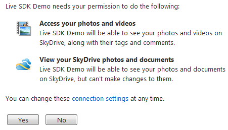
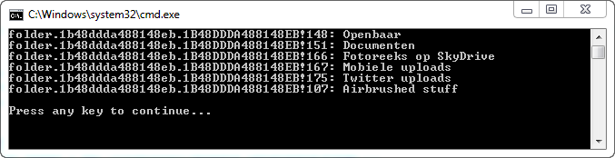

# SkyDrive: Listing Folders and Files

## Introduction

The previous article, [Getting Started with the Live SDK: Authorization](../part-1/README.md), shows you have to request a user's permission to access parts of their Live ID, including SkyDrive.

Time to take a closer look at what we can do with the REST API and SkyDrive. Listing a user's folders and files stored in his SkyDrive seems like as good as any place to start.

## Scopes

When the user authorizes your application you can specify the scopes to which you want access. Their profile, work information, postal addresses...etc. The list goes on, you can find it here:

[http://msdn.microsoft.com/en-us/library/live/hh243646](http://msdn.microsoft.com/en-us/library/live/hh243646)

If you want to list the folders and files of the user's SkyDrive account you need to make sure you request access for the following scopes:

- **wl.skydrive**: Read access to a user's files stored in SkyDrive.
- **wl.photos**: Read access to a user's photos, videos, audio, and albums.

So let's quickly generate a new access token:

```csharp
var uri = "https://login.live.com/oauth20_authorize.srf";

var authorizeUri = new StringBuilder(uri);

authorizeUri.AppendFormat("?client_id={0}&", "your_client_id");
authorizeUri.AppendFormat("scope={0}&",
    "wl.signin%20wl.photos%20wl.skydrive");
authorizeUri.AppendFormat("response_type={0}&", "token");
authorizeUri.AppendFormat("redirect_uri={0}",
UrlEncode("http://redirect_uri.com"));
```

**Remark**: Each scope value needs to be separated by a space (%20). For brevity's sake I've put them in there directly.

The user will asked to grant the necessary permissions:



Permissions to which you already have access will not be listed again. Need more information on authorizing your application? Check ouf the [first article](../part-1/README.md).

When the user authorizes your application you will be redirected to the URL you specified and it will contain an authorization token. Get it. Even if it is ridiculously long.

## Folders, Albums, Files, Photos, Videos...

If you take a look at the [REST reference](http://msdn.microsoft.com/en-us/library/live/hh243648.aspx) you'll find a couple of objects connected to SkyDrive such as Folder, Album, File, Photo, Video...etc. Most of them share a lot of properties, so let's create a base class for them.

```csharp
[JsonObject(MemberSerialization.OptIn)]
public class FileSystemInfo
{
    [JsonProperty(PropertyName = "id")]
    public string Id { get; set; }

    [JsonProperty(PropertyName = "name")]
    public string Name { get; set; }

    [JsonProperty(PropertyName = "created_time")]
    [JsonConverter(typeof(IsoDateTimeConverter))]
    public DateTime CreatedTime { get; set; }

    [JsonProperty(PropertyName = "type")]
    public string Type { get; set; }

    //...
}
```

I've not listed all the properties here, there are too many. Check out the REST reference, compare the objects and add the common properties. The JSON.NET attributes will help us later when deserialing the response.

Photos have a couple of different properties. Let's add those to a descendant class.

```csharp
[JsonObject(MemberSerialization.OptIn)]
public class Photo : FileSystemInfo
{
    [JsonProperty("size")]
    public int Size { get; set; }

    [JsonProperty("when_taken")]
    public DateTime? WhenTaken { get; set; }

    [JsonProperty("location")]
    public Location Location { get; set; }

    //...
}
```

Again not all properties are listed. Check out the [Photo Object](http://msdn.microsoft.com/en-us/library/live/hh243648.aspx#photo) if you want to add more.

The same goes for the Video object. I'll not list it here, just check out the source code that comes with this article.

Did you notice the Type (string) property on the FileSystemInfo class? This type will tell us what type of object we are dealing with. Folder, photo, video...etc. It will come in handy when deserializing the returned data.

## Listing Folders

To list all the folder of a user's SkyDrive account you simply sent a GET request to:

[https://apis.live.net/v5.0/me/skydrive/files](https://apis.live.net/v5.0/me/skydrive/files)

Just don't forget to append the access token.

```csharp
var requestUri = new StringBuilder("https://apis.live.net/v5.0/me/skydrive/files");
requestUri.AppendFormat("?access_token={0}", "access token");
var request = (HttpWebRequest)WebRequest.Create(requestUri.ToString());
request.Method = "GET";
```

The response will, as always, be JSON-formatted. Let's deserialize it to an IEnumerable of Folder. But first add the following SkyDrive type to your project.

```csharp
[JsonObject(MemberSerialization.OptIn)]
public class SkyDrive
{
    [JsonProperty(PropertyName = "data")]
    public IEnumerable<Folder> Folders { get; set; }
}
```

Now you can easily deserialize the list of folders.

```csharp
var response = (HttpWebResponse)request.GetResponse();
using (var reader = new StreamReader(response.GetResponseStream()))
{
    var json = reader.ReadToEnd();

    var skyDrive = JsonConvert.DeserializeObject<SkyDrive>(json);

    foreach (var folder in skyDrive.Folders)
    {
        Console.WriteLine(String.Format("{0}: {1}", folder.Id, folder.Name));
    }
}
```

This will output all the folders in the user's SkyDrive root.



## Other Content Types

The previous example is a bit hopeful. Only store folders and you'll be fine. No files please. They will be treated as folders.

To use the other content types (album, photo, video, file...etc.) you have to inspect the type property. Once you have the JSON response, parse it and inspect the returned data.

For example:

```csharp
var json = JObject.Parse(reader.ReadToEnd());

var contents = new List<FileSystemInfo>();
foreach (var item in json["data"])
{
    var type = item["type"].ToString();
    switch (type)
    {
        case "photo":
            contents.Add(JsonConvert.DeserializeObject<Photo>(item.ToString()));
            break;

        case "video":
            contents.Add(JsonConvert.DeserializeObject<Video>(item.ToString()));
            break;

        case "folder":
        case "album":
            contents.Add(JsonConvert.DeserializeObject<Folder>(item.ToString()));
            break;
    }
}
```

Then you can list all the content types and use their specific properties.

```csharp
foreach (var item in contents)
{
    Console.WriteLine(String.Format("{0} : {1}", item.Type, item.Name));
    if (item is Photo)
    {
        Console.WriteLine(String.Format("Size: {0} bytes", ((Photo) item).Size));
    }
}
```

## Folder Contents

One last thing I want to address for this post is how to list a folder's contents. Listing the folders of the root folder will not return the contents (files, subfolders...) of these folders.

However requesting the contents of a folder is very similar. Instead of sending a GET request to:

[https://apis.live.net/v5.0/me/skydrive/files](https://apis.live.net/v5.0/me/skydrive/files)

You need to send a request to:

[https://apis.live.net/v5.0/{folder_id}/files](https://apis.live.net/v5.0/{folder_id}/files)

Just replace {folder_id} with the ID of the folder for which you want to list the contents and you are set.

```csharp
var uri = "https://apis.live.net/v5.0/{0}/files";
var requestUri = new StringBuilder(String.Format(uri, "your_folder_id"));
requestUri.AppendFormat("?access_token={0}", "your_access_token");
var request = (HttpWebRequest)WebRequest.Create(requestUri.ToString());
request.Method = "GET";

var response = (HttpWebResponse)request.GetResponse();
using (var reader = new StreamReader(response.GetResponseStream()))
{
    var json = JObject.Parse(reader.ReadToEnd());

    // Parse the JSON data here
    // ...
}
```
